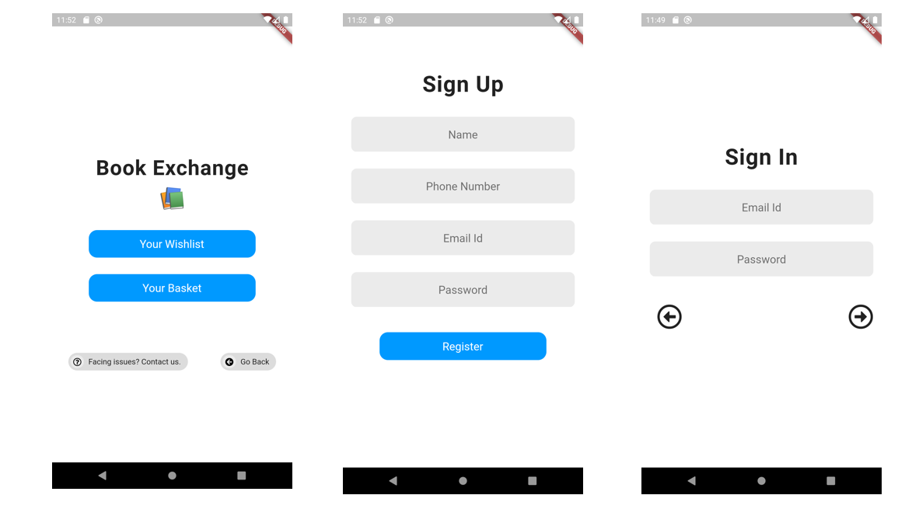
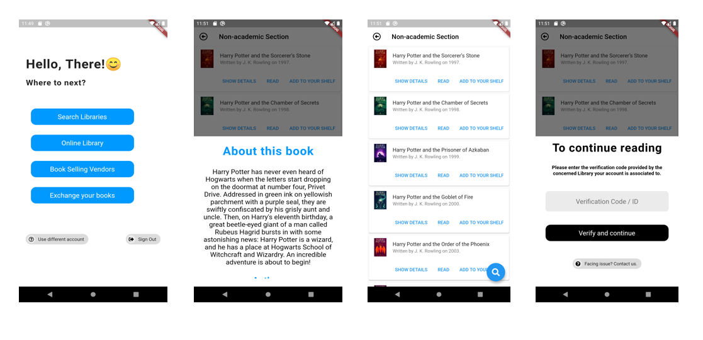

# Project Book-worm

CodeStreet'20.

Team name - [Hack- eye](https://codestreet-2020.hackerearth.com/challenges/hackathon/american-express-codestreet20/dashboard/bf28059/team/) (Smart City)

## Tools Used

This project is built using [Flutter](https://flutter.dev/docs) an open source solution by Google for building AnDroid, iOS and Web app from a single codebase.

We tried to make this app as simple and direct as possible, hence we avoided using heavy graphical UI and used less animation to keep the app size down and keep performance of our app on top.

It uses [Dart](https://dart.dev/) as it's programming language.

## Problem Statement

Today there is a trend of BOOK EXCHANGE  in India, the scale of which has never been seen before.The whole process, while novel, is Disoriented and Uncentralized with no way to keep track of things .

If we go deeper, we will find that the problem also lies in the degrading LIBRARY SYSTEM in India. Most cities have neglected this particular area even while preparing to be a smart city under present government initiative. 

There is a need to revive the Library System, making it accessible and popular among people, and Improvising Book-Exchange into an organised and user-friendly system, with the help of modern technologies, that is able to serve the current wave of book lovers.

## Description

At the Initial Stage we want to make an app that  has catalogued all the books in different libraries in a particular city(filter option available: City, Library name, Genre..etc), we plan to cover many more cities after initial release

Users would be able to issue a book online. The Librarian will get the request and will get the book ready for collection as and when demanded by the user. The issuing and return date will be strictly monitored and another person sending  an issuing request for a given book will be notified in the app  

There would be an option for individuals to make their own mini-library platform to exchange and lend the books with almost the same rules as applied for Public/Private libraries.

## Screenshots of Demo App 

# Flutter packages used

1. [FontAwesome Flutter](https://pub.dev/packages/font_awesome_flutter) for icons.
2. [Location package](https://pub.dev/packages/location) to get user's location.
3. [Here maps](https://pub.dev/packages/here_maps_webservice) for maps.
